This is the minimal version of **AEmilioDistefano's ros2_ws repository**.

**Clone this repository** onto your robot's Raspberry Pi **rather than the ros2_ws repository**.

**You don't need virtualization on your Pi**, and **cloning the entire ros2_ws repository** (which includes virtualization) onto your Pi **will dramatically increase the time it takes to clone the ros2_ws repository onto your Pi**.

# IRL Robot Setup (differential drive) 

By the end of this instructional you will have built **your own differential drive robot**, controllable via WiFi with your keyboard and ready for autonomous functions

<br>


<br>

# MATERIALS :gear:

## ONE Raspberry Pi 4 with 4 gigs of RAM (we used Model B)
<br> 

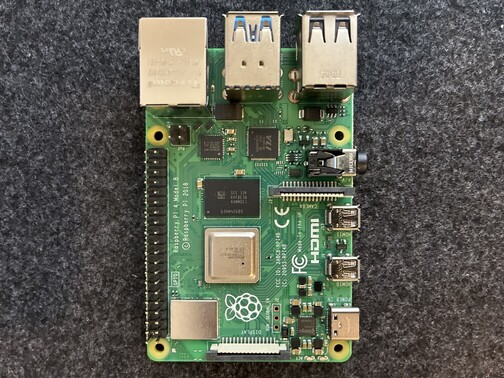 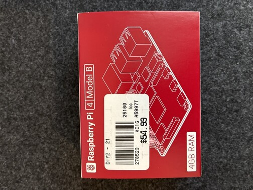 
<br>
You can **use another Pi model**, but the flash SD card **preparation will be slightly different** (albeit **self-explanatory**) 
<br>

## ONE L298N Motor Controller

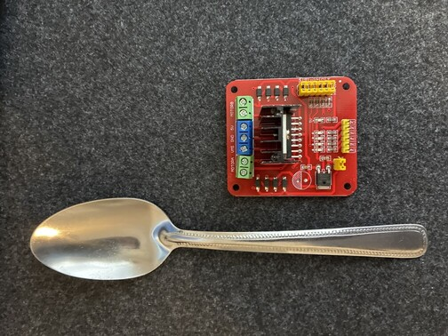 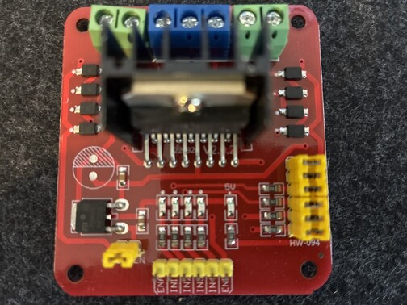
<br>
(depicted above is one example of a viable option, your motor controller may look different)


## ONE power bank or portable phone charger (at least 10,000 mAh, QC at least 18W, PD at least 18W),  **must include USB to type-c charge cable**) 


<br>
(depicted above is one example of a viable option, your power bank may look different)


## ONE fuse holder **with at least one 5W fuse** (can be for car, motorcycle, or other type of machine)

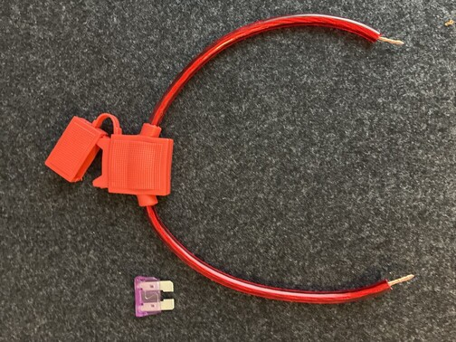 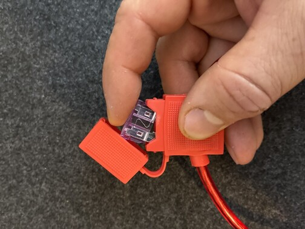
<br>
(depicted above is one example of a viable option, your fuse and fuse holder may look different)


## ONE simple ON /OFF switch 

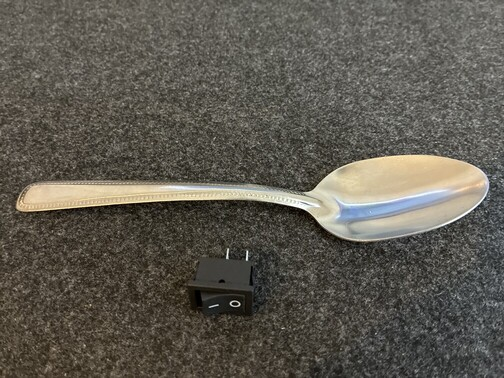 
<br>
(depicted above is one example of a viable option, your ON / OFF switch may look different)


## AT LEAST TWO 3.7V 18650 Li-ion battery (at least 2,200 mAh) (make sure to also get the battery charger!)

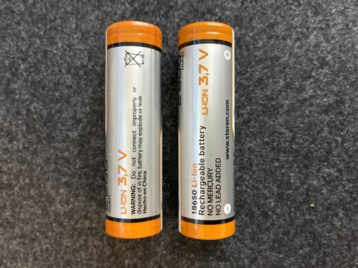 
<br>
(depicted above is one example of a viable option, your batteries may look different)


## AT LEAST TWO battery holders for your Li-ion batteries

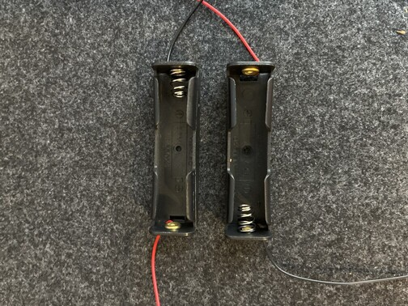 
<br>
(depicted above is one example of a viable option, your battery holders may look different)


## ONE USB webcam 

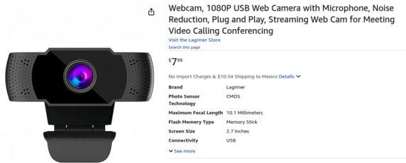 
<br>
(depicted above is one example of a viable option, your webcam may look different)


## ONE PACK of female-to-female jumper cables 

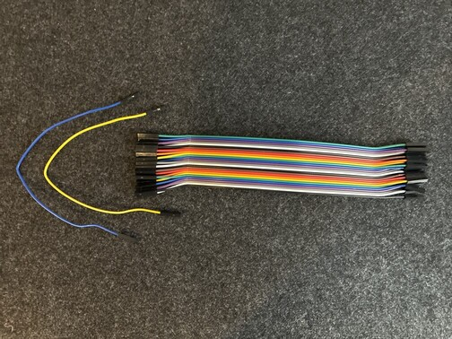 
<br>
(depicted above is one example of a viable option, your jumper cables may look different)

## ONE PACK of male-to-female jumper cables

**NOTE:** The female side of these jumper cables will be cut off, so **male-to-male jumper cables would also work here**
**HOWEVER**, you will definitely need at least one female-to-male jumper cable to connect the GND on the Pi to GND on the motor controller

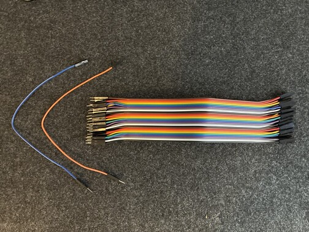 
<br>
(depicted above is one example of a viable option, your jumper cables may look different)


## ONE chassis with **FOUR** DC gear motors (make sure to buy a wheel for each motor, 4 total)

**These DC gear motors are easy to find at hobby shops**.  You can make your own chassis or buy an assembled chassis that already includes four motors similar to the yellow DC gear motors depicted below.

The tracks in the image were 3D printed on a Creality K1C.  Hand-straightened paperclips were used as connectors for the track segments.

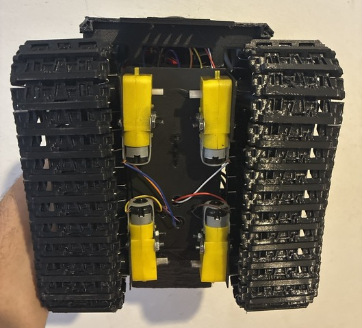 
<br>
(depicted above is one example of a viable option, your chassis may look different)


We will not include instructions on how to make your own chassis, these can be bought ready-made or assembled easily from a small rectangle of sheet metal and some simple tools. 

The outer shell of the robot in the GIF was made using a 3D printer, but this can be made by hand or made from a recycled plastic shell of any kind.

<br>
<br>
<br>

# TOOLS :toolbox:

Almost all of these tools can be replaced with basic household items, but we will include this list of tools for those who have them on-hand

**at least ONE** pair of tweezers to hold wires steady within the robot during final build steps

**ONE** screwdriver set, or a screwdriver with a tip small enough for M2, M2.5, or M3 screws (these screws will be used to attach your pi and your motor controller to your chassis, if you dedice to connect these components to the chassis in another way then the screwdriver will not be needed)

**ONE** wire stripper (or a nail clipper and very steady hands) 

**ONE** hot silicone gun (or any thick adhesive)

<br>
<br>
<br>

# 1. PREPARE your SD card for the Raspberry Pi by flashing it with Ubuntu 24.04 Noble (server)

### Use Raspberry Pi Imager

**Then insert the SD into your Pi**

<br>
<br>
<br>

# 2. Connect your Pi to your motor controller

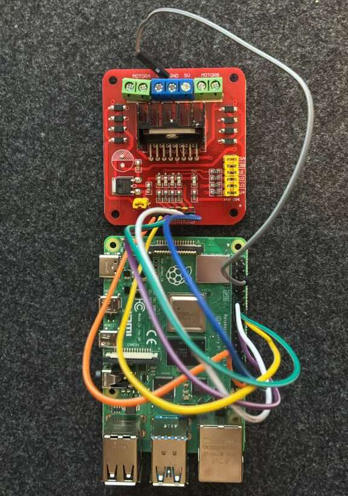

After **mounting the Pi and the Motor Controller onto the chassis**, it's time to wire everything together.

The GPIO pins on the Raspberry Pi will connect to the pins on your L298N Motor Controller.  The controler used in this tutorial has pin labels **ENA, IN1, IN2, IN3, IN4, and ENB**.  These are the controler pins that look like the GPIO pins on your Raspberry Pi.  If your controler's pin labels are different, check the list below to see which of your pins 

**ENA** is sometimes labeled as **EN A**, **EA**, **PWM_A**, **PWMA**, **EN1**, or **ENABLE_A**

**ENB** is also sometimes labeled as **ENB**, **EN B**, **EB**, **PWM_B**, **PWMB**, **EN2**, **ENABLE_B**

**IN1** is sometimes labeled as **INA1**, **AIN1**, or **I1**

**IN2** is sometimes labeled as **INA2**, **AIN2**, or **I2**

**IN3** is sometimes labeled as **INA3**, **AIN3**, or **I3**

**IN4** is sometimes labeled as **INA4**, **AIN4**, or **I4**

### Connect the following pins on the motor controller to the folowing pins on the Raspberry Pi:

**ENA** to ****
**ENB** to ****
**IN1** to ****
**IN2** to ****
**IN3** to ****
**IN4** to ****

These connections are depicted below:

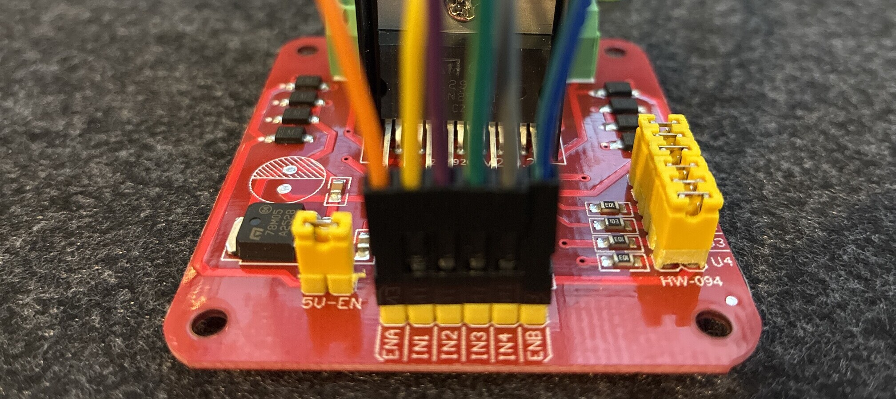 

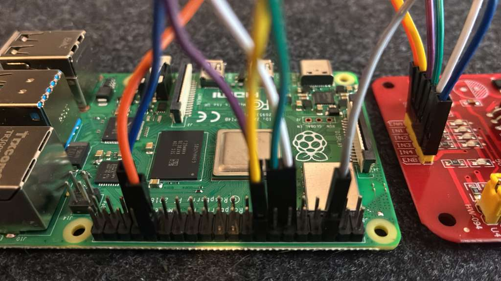

The GPIO pins connected to the motor controller will be referenced in our code:

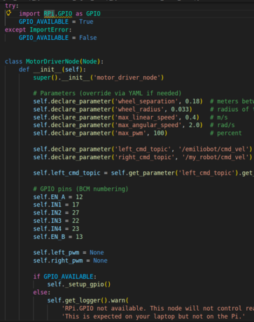 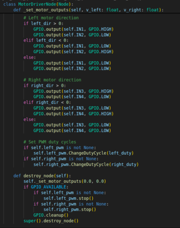

<br>
<br>
<br>

# 3. Connect your motors to your motor controller 

## 4.1 

<br>
Take eight of your male-to-female _or male-to-male) 

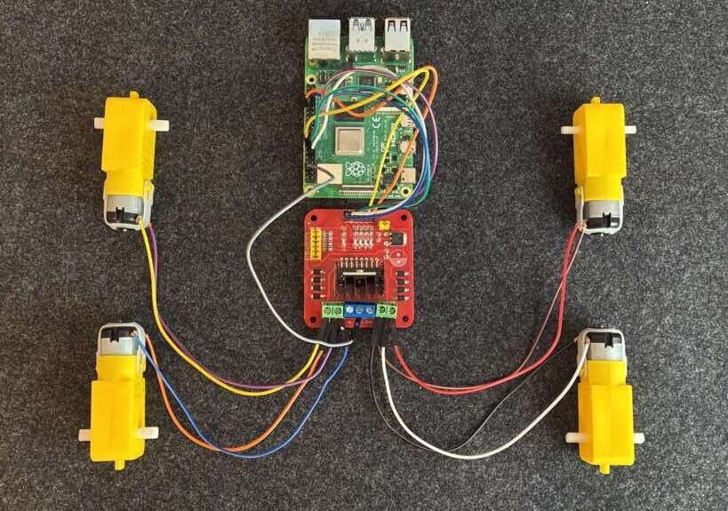

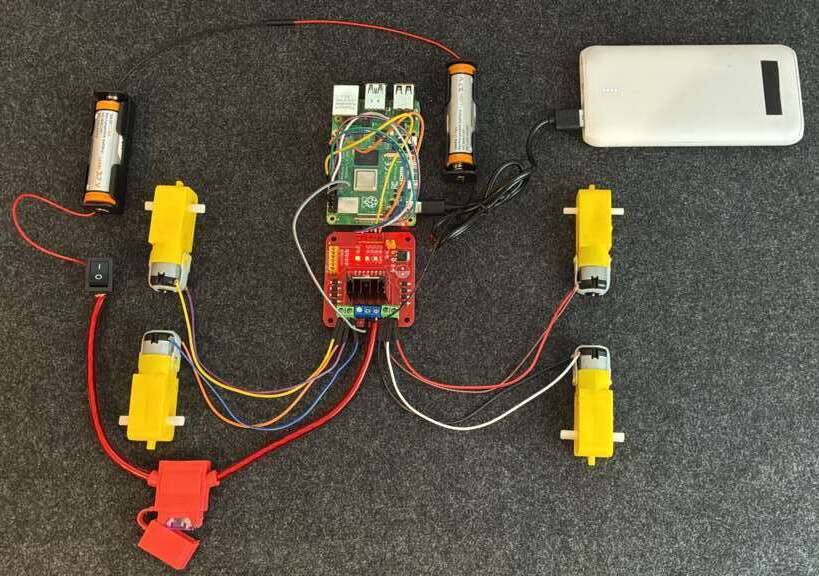


<br>
<br>
<br>

# 4. Install required software onto your Raspberry Pi

## 4.1 SSH into your Pi 
<br>
In the following command, replace **name** with **the name you set for the Pi** when you flashed the Ubuntu image with **Raspberry Pi Imager**, and **replace <host>** with **the host name you set** when you flashed the Ubuntu image with **Raspberry Pi Imager** (DO NOT include the pointed brackets / carrot symbols):

```shell
ssh <name>@<host>.local

```

You will be prompted to enter **the password you set for the Pi** when you flashed the Ubuntu image with **Raspberry Pi Imager**

<br>

## 4.2 Install ROS 2 Jazzy (minimal) on the Pi
<br>
Enter the following commands to prepare your system:

```shell
sudo apt update && sudo apt upgrade -y

# Set locale (if not already)
sudo locale-gen en_US en_US.UTF-8
sudo update-locale LC_ALL=en_US.UTF-8 LANG=en_US.UTF-8
export LANG=en_US.UTF-8

```

Then install **build-essential** (includes a **C++ compiler**)

```shell
sudo apt-get update
sudo apt-get install build-essential
```

Then add the ROS2 repo:

```shell
sudo apt install -y curl gnupg2 lsb-release

sudo curl -sSL https://raw.githubusercontent.com/ros/rosdistro/master/ros.key \
  -o /usr/share/keyrings/ros-archive-keyring.gpg

echo "deb [arch=$(dpkg --print-architecture) signed-by=/usr/share/keyrings/ros-archive-keyring.gpg] \
http://packages.ros.org/ros2/ubuntu $(. /etc/os-release && echo $UBUNTU_CODENAME) main" \
| sudo tee /etc/apt/sources.list.d/ros2.list > /dev/null

sudo apt update
sudo apt install -y ros-jazzy-ros-base python3-colcon-common-extensions

```

Now add sourcing to your .bashrc file on the Pi:

```shell
echo "source /opt/ros/jazzy/setup.bash" >> ~/.bashrc
source ~/.bashrc

```

Add some packages for GPIO control, camera and CV bridge, and other tools:

```shell
sudo apt install -y python3-rpi.gpio python3-opencv \
  ros-jazzy-cv-bridge ros-jazzy-image-transport \
  ros-jazzy-geometry-msgs ros-jazzy-sensor-msgs ros-jazzy-std-msgs

```

<br>

## 4.3 Set Up ROS2 networking between your laptop and your Pi
<br>
Add these lines to the .bashrc file of both machines (Laptop and Pi):

```shell
# ROS 2 Jazzy
source /opt/ros/jazzy/setup.bash

# Same domain for laptop and Pi
export ROS_DOMAIN_ID=17

# Allow DDS to use the network (not localhost only)
export ROS_LOCALHOST_ONLY=0

```

Then source .bashrc

```shell
source ~/.bashrc

```

<br>

## 4.4 Clone the Robot Legion Teleop package
<br>
Clone this repository into your Raspberry Pi:

<br>


## 4.5 Enable GPIO Access (One-Time Setup)
<br>
The motor driver node uses Raspberry Pi GPIO. By default, Linux restricts GPIO hardware access, which will cause this error:

```shell
RuntimeError: No access to /dev/mem. Try running as root!

```

Add the current user to the GPIO group:

```shell
sudo usermod -aG gpio $USER

```

Then create a udev rule so GPIO is accessible to non-root users:

```shell
sudo usermod -aG gpio $USER

```

Reload these new rules and reboot

```shell
sudo tee /etc/udev/rules.d/99-gpiomem.rules >/dev/null <<'EOF'
KERNEL=="gpiomem", GROUP="gpio", MODE="0660"
EOF

```

**SSH back into your Raspbarry Pi** and confirm the changes

```shell
ls -l /dev/gpiomem

```

You should see **GPIO** and **crw-rw----** included in the output.

<br>
<br>
<br>

# 5. Start and control your robot 

<br>

### 5.1 Turn on your robot

**Turn on the power bank** that powers the Raspberry Pi

**Switch on** the 'ON' switch for your motors and motor controller.

** Wait about 120 seconds** for the Pi to get online

<br>

### 5.2 Open two different terminals 

**Both will stay opened** while you are controlling your robot

**In one terminal**, SSH into your robot's Raspberry Pi and clone **the minimal version of the ros2_ws workspace** into your Pi:

```shell
git clone https://github.com/AEmilioDiStefano/ros2_ws_minimal.git ros2_ws
```

**Now enter the newly cloned ros2_ws directory**:

```shell
cd ros2_ws
```

**The other terminal (on your laptop)**, enter your existing ros2_ws directory:

```shell
cd ros2_ws
```

<br>

**In both terminals**, enter the  run the following command:

```shell
unset ROS_LOCALHOST_ONLY
export ROS_DOMAIN_ID=0
source /opt/ros/jazzy/setup.bash
source ~/ros2_ws/install/setup.bash
```

<br>

### 5.3 On your Pi, run the motor controller node with the following command:


```shell
ros2 run robot_legion_teleop_python motor_driver_node
```

### 5.4 On your laptop, run the teleop node to control your robot:

```shell
ros2 run robot_legion_teleop_python legion_teleop_key
```

You may notice that the command above includes the name 'emiliobot'.  **This tutorial is currently in the process of being edited as we perform updates** such as **using a namespace rather than a robot name like 'emiliobot'**.  The appropriate changes to this tutorial will be made when the updating of the **robot_legion_teleop_python** package is complete.

<br>
<br>
<br>


